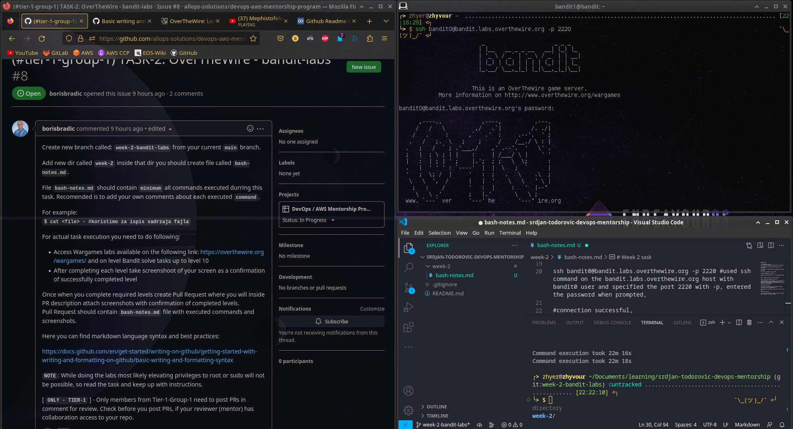
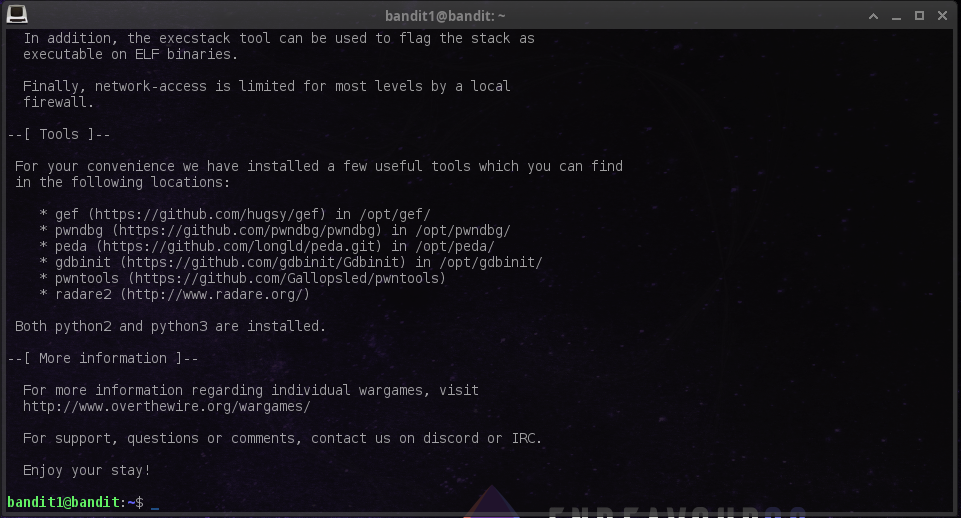
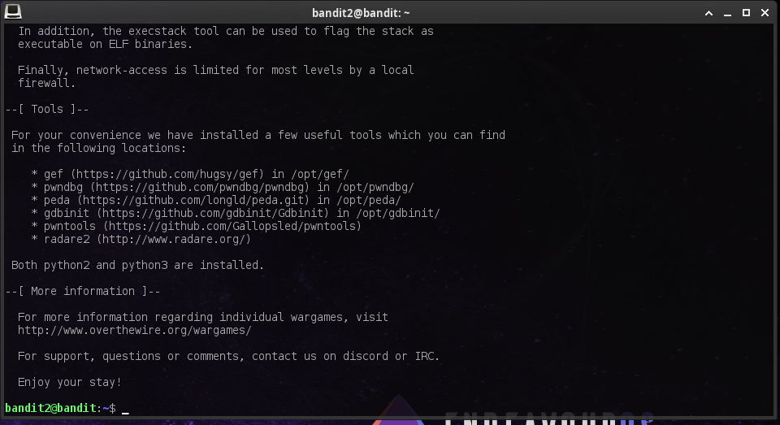
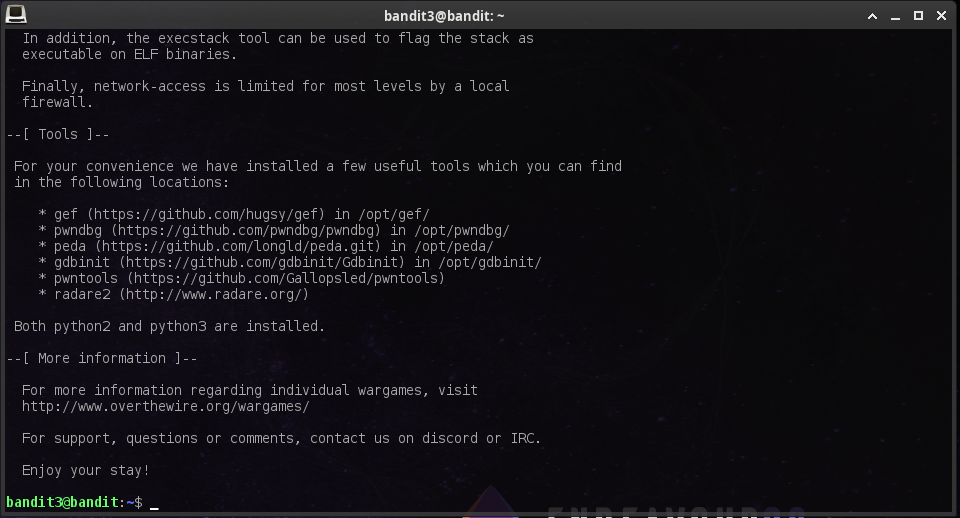
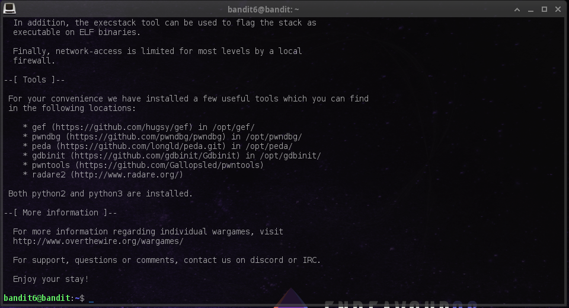
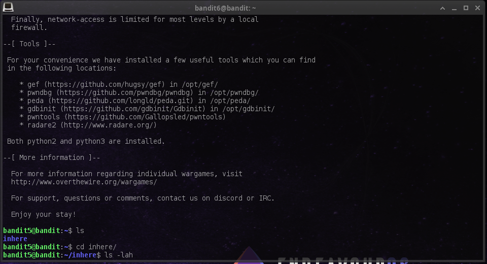
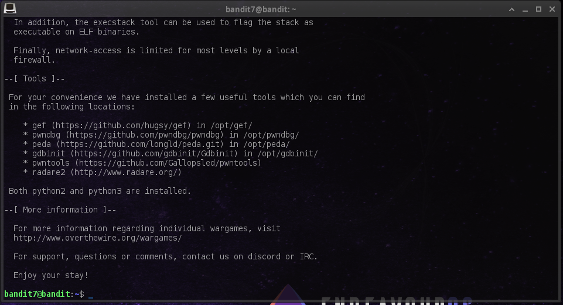
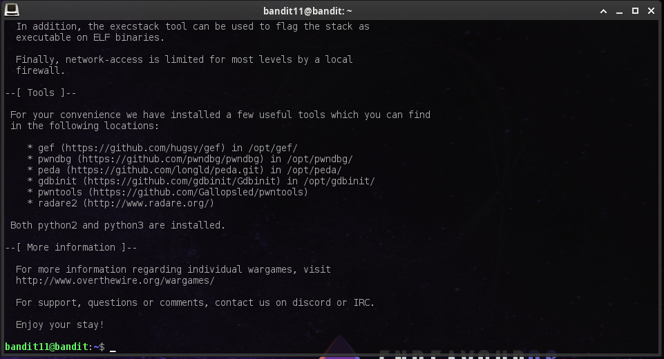
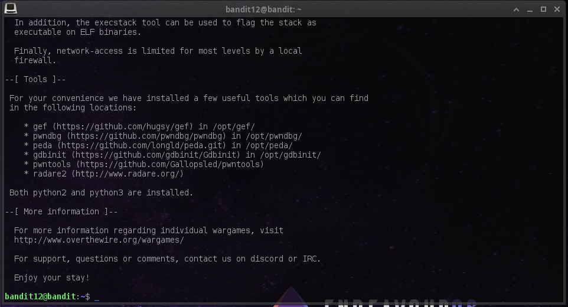

# Week 2 task
Command list:

cd ~/Documents/learning/srdjan-todorovic-devops-mentorship #path to the repo dir,

git checkout main #switched branches to main from development,

git checkout -b week-2-bandit-labs #created a new branch from main,

mkdir week-2 #created a week-2 folder,

cd week-2 #changed dir to week-2,

touch bash-notes.md #created a new file named bash-notes.md,

code . #opened vscode from current directory,

#After reading the Wargame instructions,

ssh bandit0@bandit.labs.overthewire.org -p 2220 #used ssh command on the bandit.labs.overthewire.org host with bandit0 user and specified the port 2220 with -p, entered the password when prompted,

#connection successful, 

ls #listed all items since I was already in home dir according to shell bandit0@bandit:~$

cat readme #cat the contents of the file in order to view them,

#copied the password,

sudo su bandit1 #attempted to change the user to bandit1 but failed due to no sudo privileges,

su bandit1 and pasted the password #su: Authentication failure

ctrl+d #killed ssh connection

ssh bandit1@bandit.labs.overthewire.org -p 2220 #attempted a new connection with bandit1 user and pasted the password,

connection successful

ls #the only file is -

cat - #shell got stuck,

ctrl+c #interrupted stuck shell,

ls -lah #got the list of hidden files,

cat all hidden files and check if the password is hidden in one of them,

after noticing the "Google search for "dashed filename"", I attempted:

cat "-" #did not help,

read through the google search,

cat < - #got the password,

ctrl+c #killed ssh connection,

ssh bandit2@bandit.labs.overthewire.org -p 2220 #attempted to connect with bandit2 and used the password previously obtained,

connection successful,

ls #listed files,

noticed a file with spaces,

cat "spaces in this filename" #obtained the password,

ctrl+d #killed ssh connection,

ssh bandit3@bandit.labs.overthewire.org -p 2220 #used the previously obtained password,

connection successful,

ls -lah #viewed the files,

cd inhere/ #changed dir to inhere,

cat .hidden #obtained the password,

ctrl+d #killed ssh connection,

ssh bandit4@bandit.labs.overthewire.org -p 2220 #used the obtained password,

connection successful,

ls #listed files

cd inhere/ #changed to inhere,

ls -lah #listed files,

cat < -file00 #continued cat-ing files until I found the password in -file07

ctrl+d #killed ssh connection,

ssh bandit5@bandit.labs.overthewire.org -p 2220 #used the obtained password,

connection successful,

ls #listed files,

cd inhere/ #chahnged dir to inhere,

ls -lah #listed files,

#noticed all files are dirs >.<

cd maybehere00 #changed dir to maybehere00

ls -lah #listed files,

#followed the hint:

    human-readable
    1033 bytes in size
    not executable

#until I found the pass in maybehere07,

ctrl+d #killed ssh connection,

ssh bandit6@bandit.labs.overthewire.org -p 2220 #used the obtained password,

connection successful,

#noticed I forgot to take the scr for lvl 5,

# PANIK!

#I managed to scroll up because I was still using the same terminal, **wipes sweat**

ls -lah #listed files,

#cd-ing and ls-ing mindlessly around the server,

#decided there has to be a better way,

#googled linux find file by owner and group,

find / -user bandit7 -group bandit6 -name "*" #ran find from root, that is owned by user bandit7 and group bandit6 with all possible filenames,

#found the only file I had the permission to read,

cat /var/lib/dpkg/info/bandit7.password #obtained the password,

ctrl+d #killed ssh connection,

ssh bandit7@bandit.labs.overthewire.org -p 2220 #used the obtained password,

connection successful,

ls #listed files,

cat data.txt #displayed the content of the file,

grep "millionth" data.txt #grep-ed the word millionth and obtained the password,

ctrl+d #killed ssh connection,

ssh bandit8@bandit.labs.overthewire.org -p 2220 #used the obtained password,

connection successful,

ls #listed files,

cat data.txt #displayed the file content,

#googled "linux find a line in a file that occurs only once"

cat data.txt | sort | uniq -u #displayed the file content, sorted by unique line and obtained the password,

ctrl+d #killed ssh connection,

ssh bandit9@bandit.labs.overthewire.org -p 2220 #used the obtained password,

connection successful,

ls #listed the files,

cat data.txt #displayed file content,

grep "*===" data.txt #ma'una

grep "===*" data.txt #corrected the possition of *,

#shell returned "grep: (standard input): binary file matches"

#googled "grep: (standard input): binary file matches"

grep -a "===*" data.txt #told grep to process binary as text with -a, and got the password,

ctrl+d #killed ssh connection,

ssh bandit10@bandit.labs.overthewire.org -p 2220 #used the obtained password,

connection successful,

ls #listed the files,

cat data.txt #got the output but the hint states it is base64 encoded,

#googled "bash decode base64"

cat data.txt  | base64 -d #got the password,

ctrl+d #killed ssh connection,

ssh bandit11@bandit.labs.overthewire.org -p 2220 #used the obtained password,

connection successful,

# BONUS!

ls #listed files,

cat data.txt # o,0?

#googled a-z rotated by 13, and found ROT13 wiki,

#googled rot13 and found a decoder,

#got the password after running it through a decoder,

ssh bandit12@bandit.labs.overthewire.org -p 2220 #used the obtained password,

connection successful,

ls #listed files,

cat data.txt #displayed file content,

mkdir /tmp/zhyer #as hints suggested,

cp data.txt /tmp/zhyer/ #copied the file to zhyer,

mv data.txt ./data.zip #renamed the file to .zip,

#attempted unzip but there is no unzip,

mv data.zip ./data.tar #renamed the file to .tar,

#continued to research how to figure out file type and compression methods and tried every single zip format I could find on google and decided to take a break. Noticed that I had a wrong approach because I totally igrored the part where the hint said that data.txt is a hexdump of a file.
#googled reverse hexadump of a file,

cat data.txt | xxd -r > data #reverted hexdump,

file data #now returns finally data: "gzip compressed data, was "data2.bin""

mv data data.gz #renamed the file to .gz.

gunzip data.gz #the file was unzziped to data,

file data #now returns "data: bzip2 compressed data, block size = 900k"

mv data data.bz2 #renamed data to .bz2

bzip2 -d data.bz2 #file was unzziped to data again,

file data #now returns "data: gzip compressed data, was "data4.bin""

#renamed the file again and unzipped it,

mv data data.gz
gunzip data.gz
file data #now returns "data: POSIX tar archive (GNU)"

mv data data.tar
tar -xvf data.tar #now created a file named data5.bin,

file data5.bin #now returns "data5.bin: POSIX tar archive (GNU)"

mv data5.bin data.tar
tar -xvf data.tar #returns data6.bin

file data6.bin #returns "data6.bin: bzip2 compressed data, block size = 900k"

mv data6.bin data.bz2
bzip2 -d data.bz2
file data #returns "data: POSIX tar archive (GNU)"

mv data data.tar
tar -xvf data.tar #returns tar data8.bin
file data8.bin #returns data8.bin: gzip compressed data, was "data9.bin"

mv data8.bin data.gz
gunzip data.gz #returns data
file data #returns "data: ASCII text"
cat data #It finally contained the password...

ctrl+d #killed ssh connection.

ssh bandit13@bandit.labs.overthewire.org -p 2220 #used the obtained password,

connection successful,

#decided it was time to sleep.
#started preparing for the merge request.

ctrl+d #killed ssh connection,

mkdir scrs #created a folder for screenshots,

cp /home/zhyer/Documents/learning/task-stuff/scrs/* ./scrs/ #copied all screenshots to current scrs.

